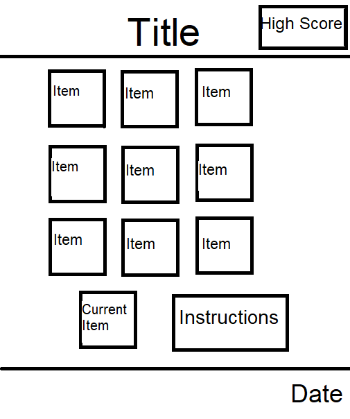

<h1 align="center">Project 2 - 'I Went to the Shops and I Bought' Game</h1>

[View the live project here.](https://a-dan-a.github.io/shops-game/)

This is an online memory game in which you have to remember an ever-growing list of items, trying to score as high as you can. It is designed predominently for children, to help their working memory. This is a game that I have used with children before to help their working memory and has helped them to increase their recall over time, so I decided that a game of this would be useful.

<h2 align="center"></h2>

## User Experience (UX)

-   ### User stories

    -   #### First Time Visitor Goals

        1. As a First Time Visitor, I want the purpose of the site to be obvious 
        2. As a First Time Visitor, I want the navigation to be obvious and easy.
        3. As a First Time Visitor, I want to know how to play the game.

    -   #### Returning Visitor Goals

        1. As a Returning Visitor, to be reminded of the rules.
        2. As a Returning Visitor, I want the game to be different every time.
        3. As a Returning Visitor, I want an incentive to play again.

    -   #### Frequent User Goals
        1. As a Frequent User, I want the game to remember my best score.
        2. As a Frequent User, I want the game to be balanced enough for me to keep improving.
        3. As a Frequent User, I want to see a measurable increase in my performance.

-   ### Design
    -   #### Colour Scheme

The main colors used are: 

| Color | Hex Code |
| :---: | :---: |
| purple | #ea00ff |
| yellow | #fffb00 |
| green | #15ff00 | 
        
with Black - #000000 and White #ffffff text.

-   #### Typography
    -   The Arial font is used throughout the site, with Helvetica and sans-serif as back-ups in case there is an error. Arial is a highly accessible and clean font that makes the site easy to read.
 -  #### Imagery
    -   Bright colors are used to make the site seem fun and vibrant for all audiences, but primarily children. Simple images of fruit are used.

*   ### Wireframes

    -   #### Desktop and tablet wireframes

        

        
        
        

 

    -   #### Mobile Wireframe 

        

        

        

## Features

-   Is responsive on all screen sizes.

-   
-   

-   
-   

-   

-   

-   

-   
-   

## Technologies Used

### Languages Used

-   [HTML5](https://en.wikipedia.org/wiki/HTML5)
-   [CSS3](https://en.wikipedia.org/wiki/Cascading_Style_Sheets)
-   [Javascript](https://www.javascript.com/)

### Frameworks, Libraries & Programs Used

1. [Bootstrap 4.2.1:](https://getbootstrap.com/docs/4.4/getting-started/introduction/)
    - Bootstrap was used to assist with the responsiveness and styling of the website.
1. [jQuery:](https://jquery.com/)
    - jQuery came with Bootstrap to make the navbar responsive but was also used for the smooth scroll function in JavaScript.
1. [GitPod](https://gitpod.io/)
    - GitPod was used as the code editor for this project, to control version control and pushing to the repository.
1. [GitHub:](https://github.com/)
    - GitHub has been used to store the project.
1. [Paint:](https://www.microsoft.com/en-us/windows/paint)
    - Paint was used to create the [wireframes]() that were used in the design process.

## Testing

The W3C Markup Validator and W3C CSS Validator Services were used to validate every page of the project to ensure there were no syntax errors in the project.

rather than do automated testing (behaviour driven route instead) identified it as a possible stratagey but explained why not used, for example this is a small project with a small development window

_____

### Testing User Stories from User Experience (UX) Section

-   #### First Time Visitor Goals

    1. As a First Time Visitor, 

        1. 
        2. 
        3. 
    
    

    2. As a First Time Visitor, I want the navigation to be obvious and easy.

        1. 
        2. 
        3. 
    

    3. 
        1. 
        2. 
        3. 
    

-   #### Returning Visitor Goals

    1. As a Returning Visitor, 

        1. 
        2. 
    
    

    2. As a Returning Visitor, 

        1. 
        2. 
        3. 
    
    

    3. As a Returning Visitor, 
        1. 
        2. 
    

-   #### Frequent User Goals

    1. As a Frequent User, 

        1. 
        2. 
        3. 
    
    

    2. As a Frequent User, 

        1. 
        2. 
    
    

    3. As a Frequent User, 
        1. 
        2. 
    
    

### Further Testing

-   The website was tested on Google Chrome and Microsoft Edge browsers.
-   The website was viewed on a laptop and a smartphone as well as by using chrome developer tools to test different screen sizes.
-   Testing was done to make sure all of the pages linked to each other and to any external links properly.

-   Testing was done with Google's Lighthouse devtool. 

-   Testing was done with the Webaim WAVE tool to test accessibility

### Known Bugs

-   `img src="images/${item}.png" alt="${item}">` solved by adding < to start of tag

-       function addRandomItemToSequence() {
        const randomItem = items[Math.floor(Math.random() * items,length)];
        gameSequence.push(randomItem);
        displayItem(randomItem);
        updateCounter();
        userSequence = [];

solved by changing a , to a .

-   function updateCounter() {
        sequenceCounter.textContent = `Sequence Length: ${gameSequence.length}`;
    }

was function updateCounter( {
        sequenceCounter.textContent = `Sequence Length: ${gameSequence.length}`;
    })

-   let usersequence = [];

should have been let userSequence = [];

-      function checkUserSequence() {
        for (let i = 0; i < userSequence.length; i++) {
            if (userSequence[i] !== gameSequence) {
                return false;
            }
        }
        return true;
    }

changed to     function checkUserSequence() {
        for (let i = 0; i < userSequence.length; i++) {
            if (userSequence[i] !== gameSequence[i]) {
                return false;
            }
        }
        return true;
    }

-   
fix high score (added high score section)

    function handleItemClick(item) {
        userSequence.push(item);
        if (!checkUserSequence()) {
            alert(`Game Over! Your list contains ${gameSequence.length - 1} items.`);
            updateHighScore();
            resetGame();
        } else if (userSequence.length === gameSequence.length) {score++;
            setTimeout(addRandomItemToSequence, 1000);
        }

-   testing - to get images of fruit to load, had to add assets/ before the images/fruit.png code

## Deployment

### GitHub Pages

The project was deployed to GitHub pages using the following steps:

1. Log into [GitHub](https://github.com/)
2. Navigate to this [repository](https://github.com/A-Dan-A/book-club/).
3. Go to settings and select pages.
4. Select 'deploy from a branch' and 'main' as the root.
5. There should now be a link to the published website once it is ready.

### Forking the GitHub Repository

By forking the GitHub Repository a copy of the original repository is made, so we can make changes without the original being changed.

1. Log in to GitHub and locate the [GitHub Repository](https://github.com/)
2. At the top of the Repository,above the "Settings" Button on the menu, locate the "Fork" Button.
3. A copy of the original repository should now be in your account.

### Making a Local Clone

1. Log in to GitHub and locate the [GitHub Repository](https://github.com/)
2. Click "Clone or download", which are underneath the repository name.
3. Copy the link under "Clone with HTTPS" and this will clone the repositor using HTTPS.
4. Open Git Bash
5. Change the current working directory to the location where you want the cloned directory to be made.
6. Type `git clone`, then paste the URL that you copied in Step 3.
7. Press Enter, and your local clone will be created.

## Credits

### Code

-   

-   

-   

### Content

-   All the content was written by the developer.

-   The template used for the README was from a Code Institute [sample README](https://github.com/Code-Institute-Solutions/SampleREADME) that was rewritten for this specific project, but with some content retained or modified where it was used, such as credits for Bootstrap.

### Media

-   Fruit images were all from WikiMedia Commons

https://upload.wikimedia.org/wikipedia/commons/thumb/6/6e/Orange%2C_orange_peel.jpg/640px-Orange%2C_orange_peel.jpg

https://upload.wikimedia.org/wikipedia/commons/thumb/7/73/Lemon03.jpg/640px-Lemon03.jpg

https://upload.wikimedia.org/wikipedia/commons/thumb/1/1a/Pineapple_on_white_table.jpg/640px-Pineapple_on_white_table.jpg

https://upload.wikimedia.org/wikipedia/commons/thumb/0/0b/D%27anjou_pear.jpg/640px-D%27anjou_pear.jpg

https://upload.wikimedia.org/wikipedia/commons/thumb/f/f1/Coconuts_-_single_and_cracked_open.jpg/640px-Coconuts_-_single_and_cracked_open.jpg

https://upload.wikimedia.org/wikipedia/commons/thumb/0/04/Strawberry-331280433961ZpzL.png/640px-Strawberry-331280433961ZpzL.png

https://upload.wikimedia.org/wikipedia/commons/thumb/6/69/Banana.png/640px-Banana.png

https://upload.wikimedia.org/wikipedia/commons/thumb/8/8d/Red_Apple_edit.png/640px-Red_Apple_edit.png

https://upload.wikimedia.org/wikipedia/commons/thumb/1/1e/Grapes_bunch_green.png/640px-Grapes_bunch_green.png

-   

### Acknowledgements

-   My Mentor for their patience and help in problem solving and guiding me in what worked and what needed to be added or changed.

-   Tutor support at Code Institute for their support and helpful advice.