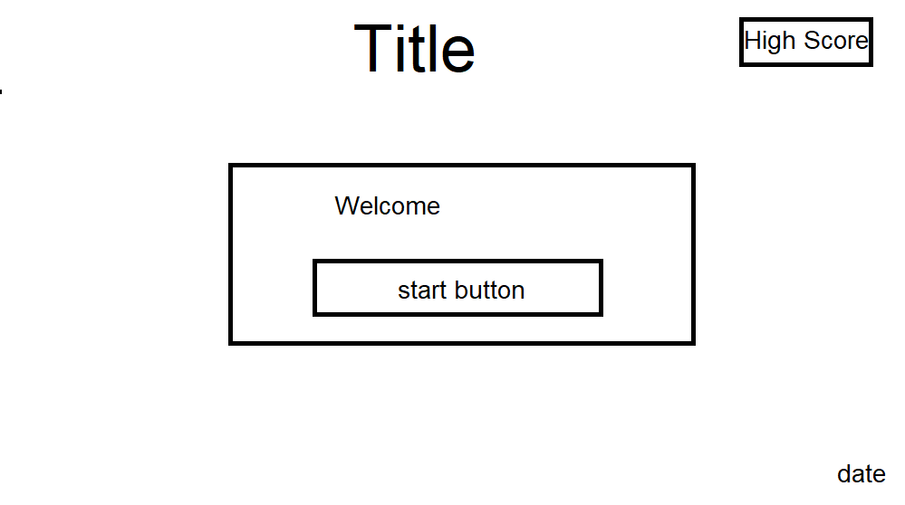

<h1 align="center">Project 2 - 'I Went to the Shops and I Bought' Game</h1>

[View the live project here.](https://a-dan-a.github.io/shops-game/)

This is an online memory game in which you have to remember an ever-growing list of items, trying to score as high as you can. It is designed predominently for children, to help their working memory. This is a game that I have used with children before to help their working memory and has helped them to increase their recall over time, so I decided that a game of this would be useful.

<h2 align="center"></h2>


## User Experience (UX)

-   ### User stories

    -   #### First Time Visitor Goals

        1. As a First Time Visitor, I want the purpose of the site to be obvious 
        2. As a First Time Visitor, I want the navigation to be obvious and easy.
        3. As a First Time Visitor, I want to know how to play the game.

    -   #### Returning Visitor Goals

        1. As a Returning Visitor, to be reminded of the rules.
        2. As a Returning Visitor, I want the game to be different every time.

    -   #### Frequent User Goals
        1. As a Frequent User, I want the game to remember my best score.
        2. As a Frequent User, I want an incentive to play again.
        3. As a Frequent User, I want to see a measurable increase in my performance.

-   ### Design
    -   #### Colour Scheme

The main colors used are: 

| Color | Hex Code |
| :---: | :---: |
| purple | #ea00ff |
| yellow | #fffb00 |
| green | #15ff00 | 
        
with Black - #000000 and White #ffffff text.

-   #### Typography
    -   The Arial font is used throughout the site, with Helvetica and sans-serif as back-ups in case there is an error. Arial is a highly accessible and clean font that makes the site easy to read.
 -  #### Imagery
    -   Bright colors are used to make the site seem fun and vibrant for all audiences, but primarily children. Simple images of fruit are used.

*   ### Wireframes

    -   #### Desktop and tablet wireframes

        

        
         

    -   #### Mobile Wireframe 

        

        

    -   #### Original Wireframe

        
        

        These are the original hand drawn wireframes. There is a slightly different layout, but is otherwise the same as the finished project. The one main difference between this and the digital wireframes is that the 'basket' feature was cut due to time constraints, but was later added back in due to it being the best way to give the user feedback when they clicked an item. It was decided that rather than the welcome page, a modal would be used to convey the instructions prior to starting the game.

## Features

-   Is responsive on all screen sizes.


-   Has a modal that gives you the instructions and can be dismissed.


-   Has a Basket section where the fruits appear as you click the right ones.
-   Has a sequence counter that goes up when a fruit is added to the sequence 
    each time you complete one sucessfully.
-   Has a high score display that shows your highest score, which is saved to local memory.


-   Has a game over pop-up that tells you what your score was
-   Has a date in the footer that automatically updates.


-   Has a 404 page with a button that redirects you back to the main page.


## Technologies Used

### Languages Used

-   [HTML5](https://en.wikipedia.org/wiki/HTML5)
-   [CSS3](https://en.wikipedia.org/wiki/Cascading_Style_Sheets)
-   [Javascript](https://www.javascript.com/)

### Frameworks, Libraries & Programs Used

1. [Bootstrap 4.2.1:](https://getbootstrap.com/docs/4.4/getting-started/introduction/)
    - Bootstrap was used to assist with the responsiveness and styling of the website.
1. [jQuery:](https://jquery.com/)
    - jQuery came with Bootstrap to make the navbar responsive but was also used for the smooth scroll function in JavaScript.
1. [GitPod](https://gitpod.io/)
    - GitPod was used as the code editor for this project, to control version control and pushing to the repository.
1. [GitHub:](https://github.com/)
    - GitHub has been used to store the project.
1. [Paint:](https://www.microsoft.com/en-us/windows/paint)
    - Paint was used to create the [wireframes]() that were used in the design process.
1. [Image Resizer:](https://imageresizer.com/)
    - This was used to resize the images, following lighthouse testing, to optimize performance.

## Testing

The W3C Markup Validator and W3C CSS Validator Services were used to validate every page of the project to ensure there were no syntax errors in the project.


_____


_____

Jshint was used to check the quality of the javascript.


### Testing User Stories from User Experience (UX) Section

-   #### First Time Visitor Goals

    1. As a First Time Visitor, I want the purpose of the site to be obvious.

        1. The game is quite a well known one, so the title being prominent will ensure anyone who knows the game
        will have an idea of what to expect from the site.
        2. The subtitle is 'A Memory Game' which tells a first time visitor with no prior knowledge of the game
        what the purpose of the site is.
        3. An instruction modal starts on the screen, explaining how the game works.
    
    

    2. As a First Time Visitor, I want the navigation to be obvious and easy.

        1. An instruction modal starts on the screen, explaining how to play the game, so a first time user knows what to do.
        2. The button to dismiss the modal is a red cross, designed to stand out and be similar to how other things are dismissed in games and on the internet.
        3. The only buttons are start game and play again, making it clear how to do start and restart the game.
        4. An instruction remains on the screen informing the user that they need to 'click the fruits in sequence to add them to your basket.' This informs the user of where to click during the game.
    
    

    3. As a First Time Visitor, I want to know how to play the game.
        1. 
        2. 
        3. 
    
    

-   #### Returning Visitor Goals

    1. As a Returning Visitor, to be reminded of the rules. 

        1. 
        2. 
    
    

    2. As a Returning Visitor, I want the game to be different every time.

        1. 
        2. 
        3. 
    
    

    3. As a Returning Visitor, 
        1. 
        2. 
    

-   #### Frequent User Goals

    1. As a Frequent User, I want the game to remember my best score. 

        1. There is a high score box that uses local storage to remember a user's best score.
        2. 
        3. 
    

    2. As a Frequent User, I want an incentive to play again. 

        1. In the modal, there is a notification saying that new lists are coming soon, to encourage frequent users to return.
        2. 
    

    3. As a Frequent User, I want to see a measurable increase in my performance.
        1. 
        2. 
    


### Further Testing

-   The website was tested on Google Chrome and Microsoft Edge browsers.

-   The website was viewed on a laptop and a smartphone as well as by using chrome developer tools to test      
    different screen sizes.

-   Testing was done to make sure all of the pages linked to each other and to any external links properly.

-   Testing was done with Google's Lighthouse devtool. 


-   Testing flagged 'displays images with incorrect aspect ratio' and that they were larger than was needed, causing the page to lad slower. The images were resized to be much smaller and the correct aspect ratio. This meant best practices went up to 100%, though the performance still does need a few more fixes in order to run better, mostly due to Bootstrap. This would be a future fix, as it doesn't noticeably affect the game.

-   Testing was done with the Webaim WAVE tool to test accessibility


### Manual and Automated Testing

Automated testing would have involved writing tests before the project to ensure continuous development by using pre-written tests to ensure the software worked and fulfilled requirements. This can be essential in larger projects because it means that the testing is done by the tool/script, which can do testing faster and more efficiently. The script would be a set of instructions to be performed to validate a feature or expected outcome. This is more narrow in what it tests as you are telling it exactly what to look for and involves coding the test and maintenance to ensure it continues working as needed. I decided that as it was a small project with relatively limited functionality compared to a larger game or website, this would not be best suited to automated development.

Manual testing involves testing components of your game versus expected functionality. You are testing against expected outcomes just as automated testing does, but doing it manually allows for handling more complex scenarios as you can adjust as you go along, whereas automated testing is more rigid. As this was a small project I decided this would be the most suitable method. The testing is also focussed mostly on inputs that will be used by the user, so testing them as if I was the user is a more focussed way to make sure it works not just from a code standpoint, but a gameplay one. I wrote a list of expected functions of the game and site, then tested those to ensure they functioned as expected and therefore was behaviour driven to meet the needs of the user.

-   Homepage loading as expected. &check;
-   Start button begins the game. &check;
-   Start button is hidden after being pressed. &check;
-   Play again/reset button appears when Start Button is hidden. &check;
-   Play again Button is hidden when pressed and the start button is visible. &check;
-   When the start button is pressed, the current item box appears and has an item in it. &check;
-   When the correct item is pressed it appears in the basket. &check;
-   When the sequence is completed successfully, the items disappear from the basket after a short pause. &check;
-   When the sequence is completed successfully the sequence counter goes up by one. &check;
-   When the sequence is completed successfully a new item appears in the current item box. &check;
-   When an incorrect item is clicked, the game over pop-up appears with your final score. &check;
-   Before the game has started, clicking the items does nothing. &check;
-   When the game is over, the high score will be updated if it was beaten. &check;

### Known Bugs
  
``` 
`img src="images/${item}.png" alt="${item}">`  
```
-   Tag not properly closed. Solved by adding < to start of tag
```
<`img src="images/${item}.png" alt="${item}">`
```

```
const randomItem = items[Math.floor(Math.random() * items,length)];
```
-   Incorrect symbol used. Solved by changing a , to a .
```
const randomItem = items[Math.floor(Math.random() * items.length)];
```

```
function updateCounter( {
sequenceCounter.textContent = `Sequence Length: ${gameSequence.length}`;
})
```
-   Closing bracket in the wrong place. Solved by moving the ) next to updateCounter
```
function updateCounter() {
        sequenceCounter.textContent = `Sequence Length: ${gameSequence.length}`;
    }
```

```
let usersequence = [];
```
-   Uppercase not used properly in declaration. Solved by adding the capital for Sequence
```
let userSequence = [];
```

```
function checkUserSequence() {
    for (let i = 0; i < userSequence.length; i++) {
        if (userSequence[i] !== gameSequence) {
        return false;
        }
    }
    return true;
}
```

-   Index symbol missing. Solved by adding [i] after gameSequence.
```
function checkUserSequence() {
    for (let i = 0; i < userSequence.length; i++) {
        if (userSequence[i] !== gameSequence[i]) {
        return false;
        }
    }
    return true;
}
```
-   High score function not called within if statement. Added updateHighScore(); in correct place.
```
function handleItemClick(item) {
    userSequence.push(item);
    if (!checkUserSequence()) {
        alert(`Game Over! Your list contains ${gameSequence.length - 1} items.`);
        updateHighScore();
        resetGame();
    } else if (userSequence.length === gameSequence.length) {score++;
        setTimeout(addRandomItemToSequence, 1000);
    }
}
```

-   Images not loading - to get images of fruit to load, had to add assets/ before the images/fruit.png code.

-   Added 'if' statement to stop an error appearing in the console because of 'null' being returned.
```
	if (highScoreDisplay) {
		highScoreDisplay.textContent = `High Score: ${highScore}`;
	}
```

## Deployment

### GitHub Pages

The project was deployed to GitHub pages using the following steps:

1. Log into [GitHub](https://github.com/)
2. Navigate to this [repository](https://github.com/A-Dan-A/book-club/).
3. Go to settings and select pages.
4. Select 'deploy from a branch' and 'main' as the root.
5. There should now be a link to the published website once it is ready.

### Forking the GitHub Repository

By forking the GitHub Repository a copy of the original repository is made, so we can make changes without the original being changed.

1. Log in to GitHub and locate the [GitHub Repository](https://github.com/)
2. At the top of the Repository,above the "Settings" Button on the menu, locate the "Fork" Button.
3. A copy of the original repository should now be in your account.

### Making a Local Clone

1. Log in to GitHub and locate the [GitHub Repository](https://github.com/)
2. Click "Clone or download", which are underneath the repository name.
3. Copy the link under "Clone with HTTPS" and this will clone the repositor using HTTPS.
4. Open Git Bash
5. Change the current working directory to the location where you want the cloned directory to be made.
6. Type `git clone`, then paste the URL that you copied in Step 3.
7. Press Enter, and your local clone will be created.

## Credits

### Content

-   All the content was written by the developer.

-   The template used for the README was from a Code Institute [sample README](https://github.com/Code-Institute-Solutions/SampleREADME) that was rewritten for this specific project, but with some content retained or modified where it was used, such as credits for Bootstrap.

### Media

-   Fruit images were all from WikiMedia Commons

[Orange](https://upload.wikimedia.org/wikipedia/commons/thumb/6/6e/Orange%2C_orange_peel.jpg/640px-Orange%2C_orange_peel.jpg)

[Lemon](https://upload.wikimedia.org/wikipedia/commons/thumb/7/73/Lemon03.jpg/640px-Lemon03.jpg)

[Pineapple](https://upload.wikimedia.org/wikipedia/commons/thumb/1/1a/Pineapple_on_white_table.jpg/640px-Pineapple_on_white_table.jpg)

[Pear](https://upload.wikimedia.org/wikipedia/commons/thumb/0/0b/D%27anjou_pear.jpg/640px-D%27anjou_pear.jpg)

[Coconut](https://upload.wikimedia.org/wikipedia/commons/thumb/f/f1/Coconuts_-_single_and_cracked_open.jpg/640px-Coconuts_-_single_and_cracked_open.jpg)

[Strawberry](https://upload.wikimedia.org/wikipedia/commons/thumb/0/04/Strawberry-331280433961ZpzL.png/640px-Strawberry-331280433961ZpzL.png)

[Banana](https://upload.wikimedia.org/wikipedia/commons/thumb/6/69/Banana.png/640px-Banana.png)

[Apple](https://upload.wikimedia.org/wikipedia/commons/thumb/8/8d/Red_Apple_edit.png/640px-Red_Apple_edit.png)

[Grapes](https://upload.wikimedia.org/wikipedia/commons/thumb/1/1e/Grapes_bunch_green.png/640px-Grapes_bunch_green.png)
 

### Acknowledgements

-   My Mentor for their patience and help in problem solving and guiding me in what worked and what needed to be added or changed.

-   Tutor support at Code Institute for their support and helpful advice.